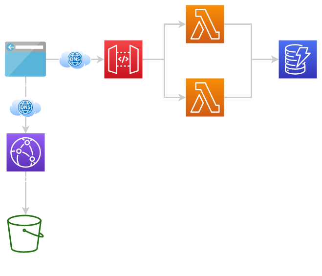
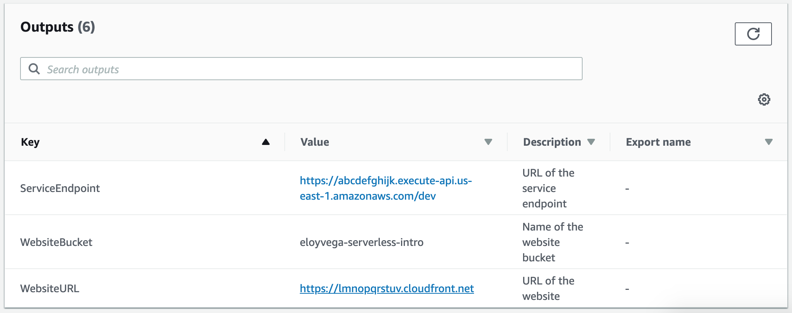
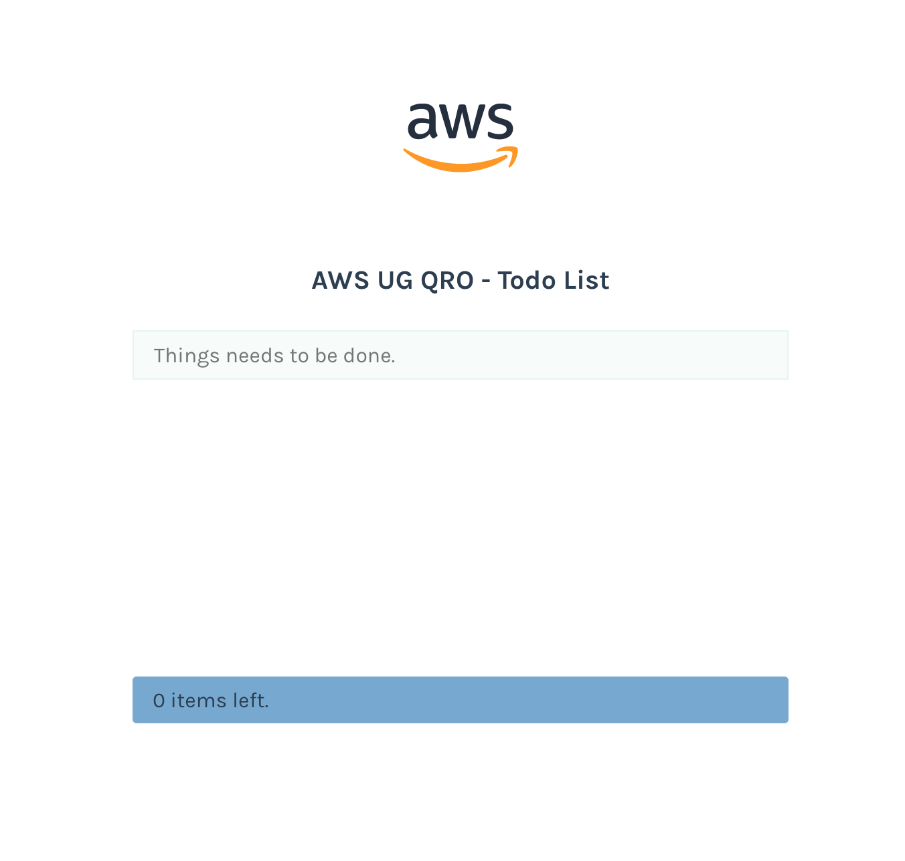

# Introducción a Serverless

Aplicación de To-do para ejemplificar el uso de Serverless Framework

## IDE

Desplegar un IDE de Cloud9 con este repositorio (opcional):

[](https://console.aws.amazon.com/cloudformation/home?region=us-east-1#/stacks/new?stackName=serverless-intro&templateURL=https://cloudtitlan-public-cfn-templates.s3.amazonaws.com/serverless-intro.yaml)

## Diagrama de la aplicación

Infraestructura:

- Bucket de S3 para alojar el sitio web (frontend)
- Distribución de Cloudfront para servir el sitio web (frontend)
- Tabla de DynamoDB para almacenar las tareas de la lista por hacer
- Funciones Lambda para obtener e insertar tareas a Dynamo (backend)
- API Gateway como punto de entrada para las funciones Lambda (backend)



## Instalación

Instalar Serverless con npm:

```
npm install -g serverless
```

## Despliegue del backend

Antes de desplegar el backend es necesario configurarlo. Edita el archivo `env.yml` para cambiar el valor de la variable `bucketName` por un nombre único para el bucket de S3.

Ejecuta el siguiente comando para crear toda la infraestructura de la aplicación y despliega las funciones Lambda junto con API Gateway (puede tomar varios minutos la primera vez):

```
serverless deploy
```

## Valores de salida de CloudFormation

Ve a la consola de AWS y en el servicio de CloudFormation busca el stack que acabamos de crear, si no has cambiado los valores por default, es `intro-to-serverless-dev`. Click en la sección de `Outputs` y anota los valores de:

- ServiceEndpoint
- WebsiteBucket
- WebsiteURL



## Despliegue del frontend

Primer configura el archivo `frontend/.env` y remplaza el valor de la variable `VUE_APP_TODO_API` con el valor de la salida de CloudFormation `ServiceEndpoint`.

Para construir los archivos estáticos del sitio web ejecuta los siguientes comandos:

```
( cd frontend ; npm install ; npm run build )
```

Esto crea la carpeta `frontend/docs` que contiene los archivos estáticos que subiremos con el siguiente comando:

```
serverless client deploy
```

Pide nuestra confirmación:

```
Serverless: This deployment will:
Serverless: - Upload all files from 'frontend/docs' to bucket 'eloyvega-serverless-intro'
? Do you want to proceed? (Y/n)
```

Escribe `y`, da Enter y listo!

## Validación

Visita la URL que obtuviste en la salida de CloudFormation con el valor de `WebsiteURL` y verifica que la aplicación se encuentra en ejecución:



## Limpieza

Para eliminar todos los recursos de tu cuenta de AWS ejecuta los siguientes comandos:

```
serverless client remove
serverless remove
```
